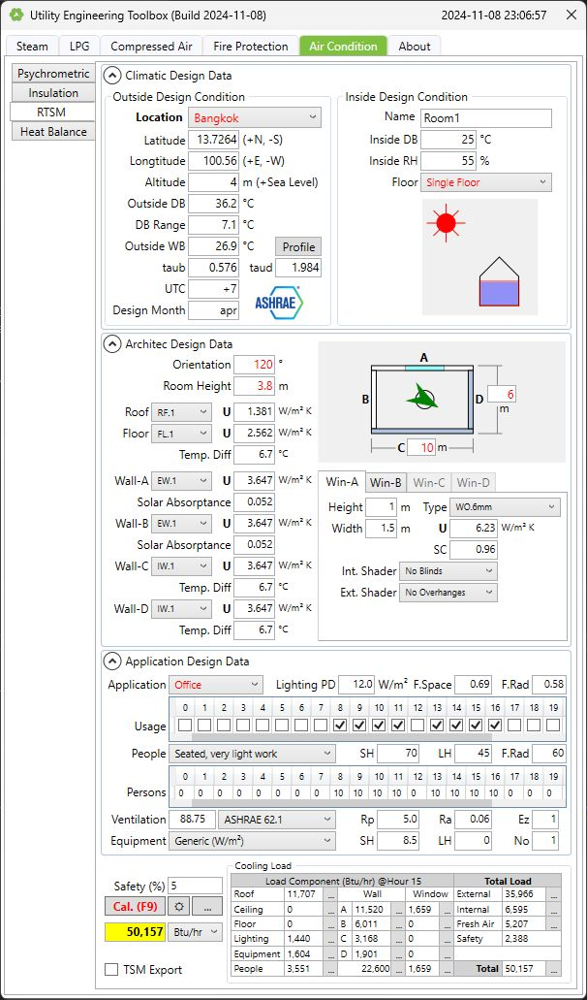

# pyMEP Package

A Python library for MEP engineering:
- coolingload : based upon ASHRAE's Fundamentals 2021 Radiant-Times-Series (RTS) method.
-

> [!NOTE]
> Example scripts and notebooks can be found under `docs/examples`. More examples
> will be added over time.

## Overview
At this moment the following subpackages are part of `pyMEP`:

**coolingload**
A package for doing cooling load calculations of a building, based upon ASHRAE's
Radiant-Times-Series (RTS) method.

Besides the aforementioned application-oriented packages, `pyMEP` also includes a
number of more basic subpackages which are used throughout the modules of
`pyMEP`:

First of all, `pyMEP` is heavily based on third-party library `pint` for
working with physical quantities in Python. Module `pint_setup.py` inside `pyMEP`
does the necessary setup for using Pint's `Quantity` class throughout the
package. When you write a script using package `pyMEP`, simply write `from pymep
import Quantity` to work with physical quantities in your script.

Subpackage `substance` contains a number of modules with classes that act like
object-oriented wrappers around third-party libraries `CoolProp` and `aipws`.
The principal classes of `substance`, that are used extensively throughout
the code, are `steam`, `LPG` and `HumidAir`, which encapsulate CoolProp's API and
allow to accept `Quantity` objects.

Finally, subpackage `charts` contains a package `matplotlibwrapper`, being a
tiny wrapper around third-party library `matplotlib`, meant to ease the drawing
of some frequently used chart types. It also contains a module to plot
refrigeration cycles on the log-p-h diagram of a refrigerant and a module to
plot air conditioning processes on a psychrometric chart.

L.Euttana

